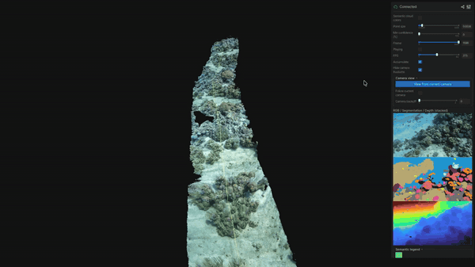

# DeepReefMap

[DeepReefMap](https://besjournals.onlinelibrary.wiley.com/doi/full/10.1111/2041-210X.14307) is a software for rapid 3D semantic mapping of coral reefs from handheld cameras. 
Repository maintained by [Hugues Sibille](https://github.com/HuguesSib) (EPFL) and [Jonathan Sauder](https://josauder.github.io/) (MIT/EPFL).



## What you get

From one input video, a run produces:

- A semantic 3D point cloud of the reef (`.ply`) - that you can open in Meshlab or CloudCompare.
- An ortho-mosaic image (`ortho.png`)
- Benthic cover statistics per class (`benthic_cover.json`)
- An interactive 3D viewer to inspect the result

## Quickstart

Example input clip (10s GoPro Hero 10, Linear mode):


Get a first reconstruction running in three commands. This uses the lightest backend (`scsfmlearner`) and the bundled GoPro Hero 10 profile.

```bash
# 1. Install
uv sync

# 2. Run a reconstruction
uv run deepreefmap reconstruct \
  --videos assets/demo_input.mp4 \
  --camera-profile gopro_hero_10 \
  --mapping scsfmlearner \
  --out out \
  --viser

# 3. Reopen the interactive viewer later
uv run deepreefmap view-run --run-dir out --viser-port 8080
```

Don't have a GoPro Hero 10? See [Camera setup](#camera-setup-and-calibration) to calibrate your own. 
Want better quality? See the [LoGeR backend](#loger-higher-quality-more-setup).

## How it works

At a high level, a run does four things:

1. Reads one or more videos in order.
2. Rectifies frames using a camera profile.
3. Runs semantic segmentation and depth/pose reconstruction.
4. Exports point clouds, ortho products, and reports.

## Requirements

- Python 3.10, 3.11, or 3.12
- `[uv](https://docs.astral.sh/uv/)` for dependency management
- FFmpeg (pulled in via `imageio[ffmpeg]`)
- **GPU**: strongly recommended. CPU-only runs work with `scsfmlearner` but are slow. The `loger` / `loger_star` backends require CUDA.

## Installation

```bash
uv sync
```

Optional extras:

```bash
uv sync --extra gopro --extra train
```

### Choose a reconstruction backend

To run `deepreefmap reconstruct`, you need at least one reconstruction backend:

- `scsfmlearner`: easiest to start with, no LoGeR checkpoint setup, but poorer reconstruction quality.
- `loger` (or `loger_star`): higher quality reconstruction, but requires CUDA + GPU and checkpoint download.

Important performance note:

- Without a GPU, all reconstruction backends will be slow.
- LoGeR specifically requires CUDA and a compatible GPU.

### SC-SfMLearner path (simplest)

Use `--mapping scsfmlearner`. By default, the checkpoint is downloaded from Hugging Face (`EPFL-ECEO/deepreefmap-sfm-net/scsfmlearner.pt`).

```bash
uv run deepreefmap reconstruct \
  --videos GX010001.MP4 \
  --mapping scsfmlearner \
  --camera-profile gopro_hero_10 \
  --tsdf \
  --out out_scsfm
```

### LoGeR path (higher quality, more setup)

LoGeR upstream (`https://github.com/Junyi42/LoGeR`) is vendored as a submodule at `third_party/LoGeR`.

Install dependencies and initialize submodule:

```bash
git submodule update --init --recursive
uv sync --extra loger

# Download checkpoints
curl -L -C - "https://huggingface.co/Junyi42/LoGeR/resolve/main/LoGeR/latest.pt?download=true" \
  -o third_party/LoGeR/ckpts/LoGeR/latest.pt
curl -L -C - "https://huggingface.co/Junyi42/LoGeR/resolve/main/LoGeR_star/latest.pt?download=true" \
  -o third_party/LoGeR/ckpts/LoGeR_star/latest.pt
```

And then you can run:

```bash
uv run deepreefmap reconstruct \
  --videos GX010001.MP4 \
  --mapping loger_star \
  --camera-profile gopro_hero_10 \
  --out out_loger \
```

- **DINOv3-based** (`coralscapes-vit-*-dpt`): higher quality, **requires Hugging Face authentication** (gated models).
- **SegFormer**: lighter and faster, no authentication needed.

Select with `--segmentation <model_name>`. List all available models:

```bash
uv run deepreefmap list-models
```

### Using DINOv3 models (authentication)

1. Request access on Hugging Face: see [gated model docs](https://huggingface.co/docs/hub/models-gated).
2. Authenticate locally:

```bash
uv run huggingface-cli login
```

## Camera setup and calibration

### GoPro Hero 10 in Linear mode with GoPro casing

If your footage is from a GoPro Hero 10 in Linear mode with the GoPro casing setup used by this project, use the built-in profile:

- Camera profile: `gopro_hero_10` (bundled JSON: `deepreefmap/resources/camera_profiles/gopro_hero_10.json`). You can also override or add profiles with `./camera_profiles/<name>.json` in the current working directory.

Example:

```bash
uv run deepreefmap reconstruct \
  --videos GX010001.MP4 \
  --segmentation coralscapes-vit-b-dpt \
  --camera-profile gopro_hero_10 \
  --mapping scsfmlearner \
  --out out
```

## Camera setup and calibration

### Bundled profile: GoPro Hero 10 (Linear mode, GoPro casing)

If your footage matches this setup, use `--camera-profile gopro_hero_10` (bundled at `deepreefmap/resources/camera_profiles/gopro_hero_10.json`). You can also drop your own profile at `./camera_profiles/<name>.json` in the working directory.

### Calibrating a different camera

Run a calibration clip through the built-in COLMAP-based calibrator:

```bash
uv run deepreefmap calibrate /path/to/new_video.mp4 \
  --name my_new_camera \
  --n-frames 120 \
  --fps 8 \
  --begin 30.0 \
  --end 120.0
```

Tips for a good calibration:

- Pick a clip with **strong camera translation** (moving through the scene), not mostly rotation — COLMAP needs parallax.
- Use `--begin` / `--end` to trim to the cleanest section.

Validate, then use it:

```bash
uv run deepreefmap verify-calibration my_new_camera

uv run deepreefmap reconstruct \
  --videos /path/to/new_video.mp4 \
  --camera-profile my_new_camera \
  --mapping loger \
  --out out_new_camera
```

## Outputs

Each run writes:

- `frames/`, `labels/`, `masks/` — rectified frames, semantic labels, keep masks.
- `mapping_outputs.npz` — depth, poses, intrinsics, confidence, frame indices.
- `semantic_reference_cloud.ply` — filtered semantic point cloud.
- `tsdf_cloud.ply`, `semantic_tsdf_cloud.ply` — when `--tsdf` is enabled.
- `ortho.png`, `ortho.npz` — aggregated ortho products.
- `benthic_cover.json` — class counts and cover fractions.
- `geometry_cloud.ply` — geometry-only cloud (when `--skip-segmentation`).
- `run_manifest.json` — canonical run manifest (`semantic` or `geometry_only`).

## Interactive viewer (viser)

Live during reconstruction with `--viser`, or open an existing run:

```bash
uv run deepreefmap view-run --run-dir out --viser-port 8080
```

In the viewer you can:

- Click a camera frustum to jump to that point in the timeline.
- Inspect RGB, segmentation, and depth per frame.
- Toggle class visibility and switch between RGB and semantic colors.
- Use **Accumulate** to overlay filtered points up to the current timeline index.

## CLI reference

```bash
uv run deepreefmap list-models           # available segmentation + mapping models
uv run deepreefmap list-profiles         # available camera profiles
uv run deepreefmap reconstruct ...       # main pipeline
uv run deepreefmap calibrate VIDEO ...   # camera calibration via COLMAP
uv run deepreefmap verify-calibration NAME
uv run deepreefmap render-video --run-dir out
uv run deepreefmap view-run --run-dir out --viser-port 8080
```

Useful `reconstruct` flags:

- `--grid-bins`: ortho aggregation resolution.
- `--keep-viser-open` / `--no-keep-viser-open`: keep viewer running after processing.
- `--require-gravity-telemetry`: fail if gravity telemetry cannot be loaded/aligned.
- `--preprocess-batch-size`: segmentation batch size during frame preparation.
- `--transect-length` and `--transect-crop-width`: crop outputs around dominant transect.
- `--skip-segmentation`: geometry-only run (no semantics).

## Reconstruction outputs

Each run writes cached and derived artifacts:

- `frames/`, `labels/`, `masks/`: rectified frames, semantic labels, and keep masks.
- `mapping_outputs.npz`: depth, poses, intrinsics, confidence, frame indices.
- `semantic_reference_cloud.ply`: filtered semantic point cloud.
- `tsdf_cloud.ply` and `semantic_tsdf_cloud.ply`: optional TSDF outputs when `--tsdf` is enabled.
- `ortho.png` and `ortho.npz`: aggregated ortho products.
- `benthic_cover.json`: class counts and cover fractions.
- `geometry_cloud.ply`: geometry-only cloud from `--skip-segmentation`.
- `run_manifest.json`: canonical run manifest (`semantic` or `geometry_only`).

## Viser app (interactive viewer)

You can use live viewing during reconstruction (`--viser`) or open an existing run:

```bash
uv run deepreefmap view-run --run-dir out --viser-port 8080
```

Viewer highlights:

- Click a camera frustum to jump timeline.
- Inspect RGB, segmentation, and depth for each frame.
- Toggle class visibility and switch color mode (RGB vs semantic colors).
- Use `Accumulate` to overlay filtered points up to current timeline index.

## Citation

If you use this repository or build on it, please cite DeepReefMap:

```bibtex
@article{sauder2024scalable,
  title={Scalable semantic 3D mapping of coral reefs with deep learning},
  author={Sauder, Jonathan and Banc-Prandi, Guilhem and Meibom, Anders and Tuia, Devis},
  journal={Methods in Ecology and Evolution},
  volume={15},
  number={5},
  pages={916--934},
  year={2024},
  publisher={Wiley Online Library}
}
```

The segmentation models are trained on the [Coralscapes](https://josauder.github.io/coralscapes/) dataset. If you use them, please cite

```bibtex
@inproceedings{sauder2025coralscapes,
  title={The Coralscapes Dataset: Semantic scene understanding in coral reefs},
  author={Sauder, Jonathan and Domazetoski, Viktor and Banc-Prandi, Guilhem and Perna, Gabriela and Meibom, Anders and Tuia, Devis},
  booktitle={ICCV Joint Workshop on Marine Vision},
  year={2025}
}
```

If you use the **LoGeR** backend (`--mapping loger` or `loger_star`), please also cite:

```bibtex
@article{zhang2026loger,
  title={LoGeR: Long-Context Geometric Reconstruction with Hybrid Memory},
  author={Zhang, Junyi and Herrmann, Charles and Hur, Junhwa and Sun, Chen and Yang, Ming-Hsuan and Cole, Forrester and Darrell, Trevor and Sun, Deqing},
  journal={arXiv preprint arXiv:2603.03269},
  year={2026}
}
```

## Acknowledgements

DeepReefMap builds on:

- [LoGeR](https://github.com/Junyi42/LoGeR) by Zhang et al. — high-quality reconstruction backend.
- [viser](https://github.com/nerfstudio-project/viser) — interactive 3D viewer.

## License

DeepReefMap is licensed under the [Apache License 2.0](LICENSE).

Vendored or optional third-party components (notably `third_party/LoGeR` and downloaded checkpoints) carry their own terms; see `THIRD_PARTY_NOTICES.md` before redistribution.