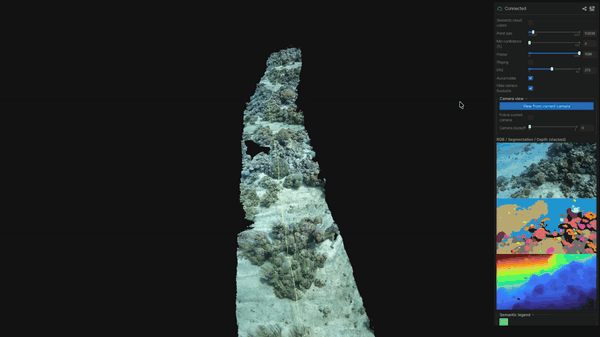

# DeepReefMap

[](LICENSE)
[](https://www.python.org/)
[](https://doi.org/10.1111/2041-210X.14307)

[DeepReefMap](https://besjournals.onlinelibrary.wiley.com/doi/full/10.1111/2041-210X.14307) is a software for rapid 3D semantic mapping of coral reefs from handheld cameras.
Repository maintained by [Hugues Sibille](https://github.com/HuguesSib) (EPFL) and [Jonathan Sauder](https://josauder.github.io/) (MIT/EPFL).



## Contents

- [What you get](#what-you-get)
- [Quickstart](#quickstart)
- [How it works](#how-it-works)
- [Desktop app](#desktop-app)
- [Requirements](#requirements)
- [Installation](#installation)
- [Choosing models](#choosing-models)
- [Camera setup and calibration](#camera-setup-and-calibration)
- [Outputs](#outputs)
- [Interactive viewer (viser)](#interactive-viewer-viser)
- [CLI reference](#cli-reference)
- [Citation](#citation)

## What you get

From one input video, a run produces:

- A semantic 3D point cloud of the reef (`.ply`) - that you can open in Meshlab or CloudCompare.
- An ortho-mosaic image (`ortho.png`)
- Benthic cover statistics per class (`benthic_cover.json`)
- An interactive 3D viewer to inspect the result

## Quickstart

Example input clip (GoPro Hero 10, Linear mode):


Get a first reconstruction running in three commands, on the 7-second clip committed for the end-to-end test. This uses the lightest reconstruction backend (`scsfmlearner`), a SegFormer segmentation model, and the bundled GoPro Hero 10 profile — all weights are public, so no Hugging Face account is needed.

```bash
# 1. Install
uv sync

# 2. Run a reconstruction
uv run deepreefmap reconstruct \
  --videos tests/data/reef_clip.mp4 \
  --camera-profile gopro_hero_10 \
  --mapping scsfmlearner \
  --segmentation segformer-b2 \
  --out out \
  --viser

# 3. Reopen the interactive viewer later
uv run deepreefmap view-run --run-dir out --viser-port 8080
```

Then:

- Higher segmentation quality? The default `coralscapes-vit-b-dpt` is better but gated — see [Using DINOv3 models](#using-dinov3-models-authentication).
- Higher reconstruction quality? See the [LoGeR backend](#loger-path-higher-quality-more-setup).
- Different camera? Only GoPro Hero 10 and 12 profiles ship with the package — see [Camera setup and calibration](#camera-setup-and-calibration) to calibrate your own.

## How it works

At a high level, a run does four things:

1. Reads one or more videos in order.
2. Rectifies frames using a camera profile.
3. Runs semantic segmentation and depth/pose reconstruction.
4. Exports point clouds, ortho products, and reports.

## Desktop app

The native desktop application lives in [deepreefmap-gui](https://github.com/eceo-epfl/deepreefmap-gui), which uses this package as a library. Prebuilt binaries for Windows, macOS, and Linux are on its releases page.

Everything below covers the library and CLI.

## Requirements

- Python 3.10, 3.11, or 3.12
- [uv](https://docs.astral.sh/uv/) for dependency management
- FFmpeg (pulled in via `imageio[ffmpeg]`)
- **GPU**: strongly recommended. NVIDIA (CUDA), AMD (ROCm), and Apple Silicon (MPS) are supported. CPU-only runs work with `scsfmlearner` but are slow.

## Installation

### NVIDIA

```bash
uv sync --extra cu126   # most cards, up to RTX 40-series
uv sync --extra cu130   # RTX 50-series (Blackwell)
```

### AMD ROCm

```bash
uv sync --extra rocm   # Linux only
```

> **Experimental.** AOTriton attention is auto-enabled so LoGeR runs on RDNA3 (set `TORCH_ROCM_AOTRITON_ENABLE_EXPERIMENTAL=0` to disable). Sync ROCm into its own venv, or a stray `triton` wheel can shadow `pytorch-triton-rocm`.

### macOS (Apple Silicon)

```bash
uv sync
```

### Optional extras

```bash
uv sync --extra gopro --extra train
```

Extras can be combined (eg. `uv sync --extra rocm --extra gopro --extra loger`).

| Extra | Purpose |
| --- | --- |
| `cu126`, `cu130`, `rocm` | GPU-specific torch builds (mutually exclusive) |
| `loger` | Runtime dependencies for the LoGeR backend |
| `gopro` | GoPro telemetry parsing (Linux x86-64 only) |
| `train` | Training/logging tools (`wandb`, `tensorboard`) |
| `dev` | `pytest`, `ruff`, `mypy` |

## Choosing models

### Reconstruction backend

To run `deepreefmap reconstruct`, you need at least one reconstruction backend:

- `scsfmlearner`: easiest to start with, no LoGeR checkpoint setup, but lower reconstruction quality.
- `loger` (or `loger_star`): higher quality reconstruction, requires a GPU and checkpoint download.

Performance notes:

- Without a GPU, all reconstruction backends will be slow.
- LoGeR requires a GPU (CUDA, ROCm, or MPS). On MPS, unsupported operations fall back to CPU automatically.

### SC-SfMLearner path (simplest)

Use `--mapping scsfmlearner`. By default, the checkpoint is downloaded from Hugging Face (`EPFL-ECEO/deepreefmap-sfm-net/scsfmlearner.pt`).

```bash
uv run deepreefmap reconstruct \
  --videos GX010001.MP4 \
  --mapping scsfmlearner \
  --camera-profile gopro_hero_10 \
  --tsdf \
  --out out_scsfm
```

### LoGeR path (higher quality, more setup)

LoGeR upstream (`https://github.com/Junyi42/LoGeR`) is vendored as a submodule at `third_party/LoGeR`.

Install dependencies and initialize submodule:

```bash
git submodule update --init --recursive
uv sync --extra loger

# Download checkpoints
curl -L -C - "https://huggingface.co/Junyi42/LoGeR/resolve/main/LoGeR/latest.pt?download=true" \
  -o third_party/LoGeR/ckpts/LoGeR/latest.pt
curl -L -C - "https://huggingface.co/Junyi42/LoGeR/resolve/main/LoGeR_star/latest.pt?download=true" \
  -o third_party/LoGeR/ckpts/LoGeR_star/latest.pt
```

And then you can run:

```bash
uv run deepreefmap reconstruct \
  --videos GX010001.MP4 \
  --mapping loger_star \
  --camera-profile gopro_hero_10 \
  --out out_loger
```

`DEEPREEFMAP_LOGER_CKPTS` overrides the LoGeR checkpoint directory, eg. to point at an existing `third_party/LoGeR/ckpts`.

### Segmentation model

Two families of segmentation models are available:

- **DINOv3-based** (`coralscapes-vit-*-dpt`): higher quality, **requires Hugging Face authentication** (gated models).
- **SegFormer**: lighter and faster, no authentication needed.

Select with `--segmentation <model_name>`. List all available models:

```bash
uv run deepreefmap list-models
```

### Using DINOv3 models (authentication)

1. Request access on Hugging Face: see [gated model docs](https://huggingface.co/docs/hub/models-gated).
2. Authenticate locally:

```bash
uv run huggingface-cli login
```

## Camera setup and calibration

### Bundled profiles

Two profiles ship with the package, under `deepreefmap/resources/camera_profiles/`. Both were calibrated with the built-in COLMAP calibrator (`RADIAL` model, 100 registered frames sampled at 10 fps).

| Profile | Camera and mode | Rectified size | Mean reprojection error |
| --- | --- | --- | --- |
| `gopro_hero_10` | Hero 10, Linear mode, GoPro casing | 1920×1080 | 0.78 px |
| `gopro_hero_12` | Hero 12, 4K Wide | 3840×2160 | 1.31 px |

List what is available in your install:

```bash
uv run deepreefmap list-profiles
```

You can also override a bundled profile or add your own by placing `./camera_profiles/<name>.json` in the current working directory.

Example:

```bash
uv run deepreefmap reconstruct \
  --videos GX010001.MP4 \
  --segmentation coralscapes-vit-b-dpt \
  --camera-profile gopro_hero_10 \
  --mapping scsfmlearner \
  --out out
```

### Calibrating a different camera

Run a calibration clip through the built-in COLMAP-based calibrator:

```bash
uv run deepreefmap calibrate /path/to/new_video.mp4 \
  --name my_new_camera \
  --n-frames 120 \
  --fps 8 \
  --begin 30.0 \
  --end 120.0
```

Tips for a good calibration:

- Pick a clip with **strong camera translation** (moving through the scene), not mostly rotation — COLMAP needs parallax.
- Use `--begin` / `--end` to trim to the cleanest section.

Validate, then use it:

```bash
uv run deepreefmap verify-calibration my_new_camera

uv run deepreefmap reconstruct \
  --videos /path/to/new_video.mp4 \
  --camera-profile my_new_camera \
  --mapping loger \
  --out out_new_camera
```

## Outputs

Each run writes:

- `frames/`, `labels/`, `masks/` — rectified frames, semantic labels, keep masks.
- `mapping_outputs.npz` — depth, poses, intrinsics, confidence, frame indices, gravity vectors, world points, and scale type. These keys are what a resumed run reads back.
- `semantic_reference_cloud.ply` — filtered semantic point cloud.
- `tsdf_cloud.ply`, `semantic_tsdf_cloud.ply` — when `--tsdf` is enabled.
- `ortho.png`, `ortho.npz` — aggregated ortho products.
- `benthic_cover.json` — class counts and cover fractions.
- `geometry_cloud.ply` — geometry-only cloud (when `--skip-segmentation`).
- `run_manifest.json` — canonical run manifest (`semantic` or `geometry_only`).

## Interactive viewer (viser)

Live during reconstruction with `--viser`, or open an existing run:

```bash
uv run deepreefmap view-run --run-dir out --viser-port 8080
```

In the viewer you can:

- Click a camera frustum to jump to that point in the timeline.
- Inspect RGB, segmentation, and depth per frame.
- Toggle class visibility and switch between RGB and semantic colors.
- Use **Accumulate** to overlay filtered points up to the current timeline index.

## CLI reference

```bash
uv run deepreefmap --version              # installed version
uv run deepreefmap list-models            # available segmentation + mapping models
uv run deepreefmap list-profiles          # available camera profiles
uv run deepreefmap reconstruct ...        # main pipeline
uv run deepreefmap calibrate VIDEO ...    # camera calibration via COLMAP
uv run deepreefmap verify-calibration NAME
uv run deepreefmap render-video --run-dir out
uv run deepreefmap view-run --run-dir out --viser-port 8080
```

Run `uv run deepreefmap reconstruct --help` for the full list. The flags you are most likely to reach for:

**Input and output**

- `--videos`: comma-separated video paths, in processing order (required).
- `--camera-profile`: profile name (required). See [Camera setup](#camera-setup-and-calibration).
- `--out`: output directory (default `out`).
- `--fps`: target processing framerate (default `10`).
- `--begin` / `--end`: trim the concatenated stream, in seconds.
- `--classes`: classes YAML with class roles and colors (default `configs/classes_coralscapes.yaml`).

**Models**

- `--segmentation`: segmentation model name (default `coralscapes-vit-b-dpt`).
- `--mapping`: reconstruction backend (default `scsfmlearner`).
- `--skip-segmentation`: geometry-only run, no semantics.

**Resolution and throughput**

- `--processing-width` / `--processing-height`: frame size before segmentation and mapping (default `1376×768`). The dominant quality/speed knob.
- `--preprocess-batch-size`: frames segmented together during preparation (default `4`).

**Point cloud and ortho**

- `--tsdf` / `--no-tsdf`: optional TSDF fusion output.
- `--grid-bins`: ortho aggregation resolution (default `2000`).
- `--replacement-radius-factor`: multiplier on the auto replacement radius (>1 coarser voxels and stronger thinning, <1 finer).
- `--replacement-radius-override`: absolute replacement voxel size in meters, skipping the auto estimate.
- `--replacement-radius-estimation-frames`: leading depth maps used for the auto estimate (default `30`).
- `--transect-length` / `--transect-crop-width`: crop outputs around the dominant transect, in meters.

**Backend-specific**

- `--loger-model-path`, `--loger-window-size` (default `32`), `--loger-overlap-size` (default `3`).
- `--scsfmlearner-checkpoint-path`, `--scsfmlearner-width` (default `512`), `--scsfmlearner-height` (default `256`).
- `--refine-intrinsics-from-mapper`: let the mapping backend refine intrinsics and override the camera profile's `K` downstream.

**Telemetry and viewer**

- `--require-gravity-telemetry`: fail the run if gravity telemetry cannot be loaded or aligned, instead of continuing unaligned.
- `--viser` / `--viser-port`: live viewer during reconstruction.
- `--keep-viser-open` / `--no-keep-viser-open`: keep the viewer running after outputs are generated (default: keep open).

## Citation

If you use this repository or build on it, please cite DeepReefMap:

```bibtex
@article{sauder2024scalable,
  title={Scalable semantic 3D mapping of coral reefs with deep learning},
  author={Sauder, Jonathan and Banc-Prandi, Guilhem and Meibom, Anders and Tuia, Devis},
  journal={Methods in Ecology and Evolution},
  volume={15},
  number={5},
  pages={916--934},
  year={2024},
  publisher={Wiley Online Library}
}
```

The segmentation models are trained on the [Coralscapes](https://josauder.github.io/coralscapes/) dataset. If you use them, please cite

```bibtex
@inproceedings{sauder2025coralscapes,
  title={The Coralscapes Dataset: Semantic scene understanding in coral reefs},
  author={Sauder, Jonathan and Domazetoski, Viktor and Banc-Prandi, Guilhem and Perna, Gabriela and Meibom, Anders and Tuia, Devis},
  booktitle={ICCV Joint Workshop on Marine Vision},
  year={2025}
}
```

If you use the **LoGeR** backend (`--mapping loger` or `loger_star`), please also cite:

```bibtex
@article{zhang2026loger,
  title={LoGeR: Long-Context Geometric Reconstruction with Hybrid Memory},
  author={Zhang, Junyi and Herrmann, Charles and Hur, Junhwa and Sun, Chen and Yang, Ming-Hsuan and Cole, Forrester and Darrell, Trevor and Sun, Deqing},
  journal={arXiv preprint arXiv:2603.03269},
  year={2026}
}
```

## Contributing

See [CONTRIBUTING.md](CONTRIBUTING.md) for development setup, the test suite, and the pull request checklist. Notable changes are recorded in [CHANGELOG.md](CHANGELOG.md).

## Acknowledgements

DeepReefMap builds on:

- [LoGeR](https://github.com/Junyi42/LoGeR) by Zhang et al. — high-quality reconstruction backend.
- [viser](https://github.com/nerfstudio-project/viser) — interactive 3D viewer.

## License

DeepReefMap is licensed under the [Apache License 2.0](LICENSE).

Vendored or optional third-party components (notably `third_party/LoGeR` and downloaded checkpoints) carry their own terms; see `THIRD_PARTY_NOTICES.md` before redistribution.
